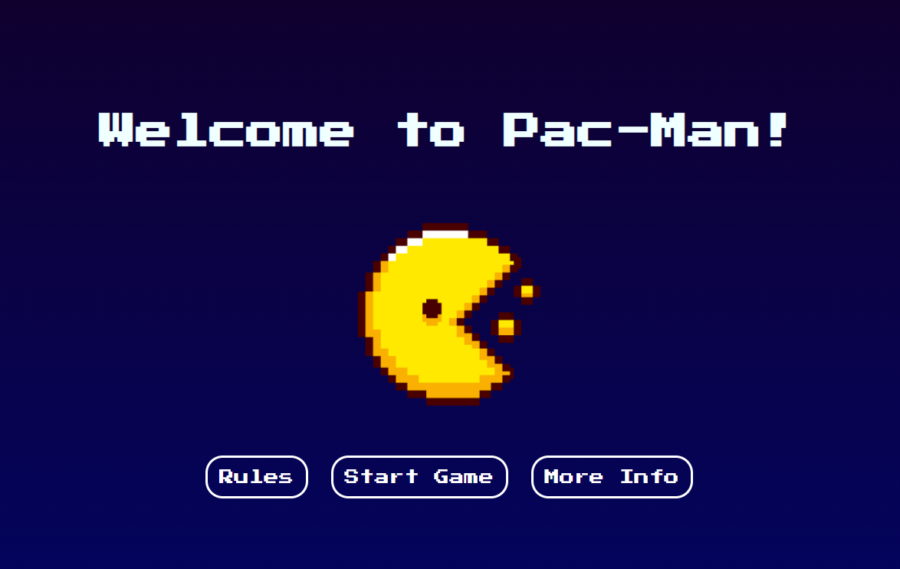
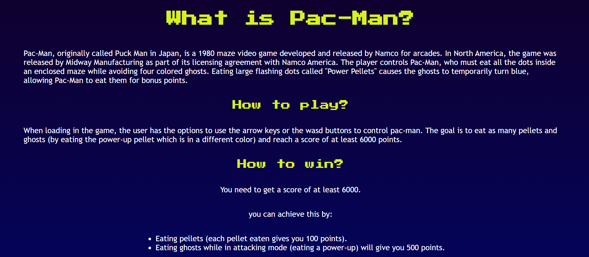
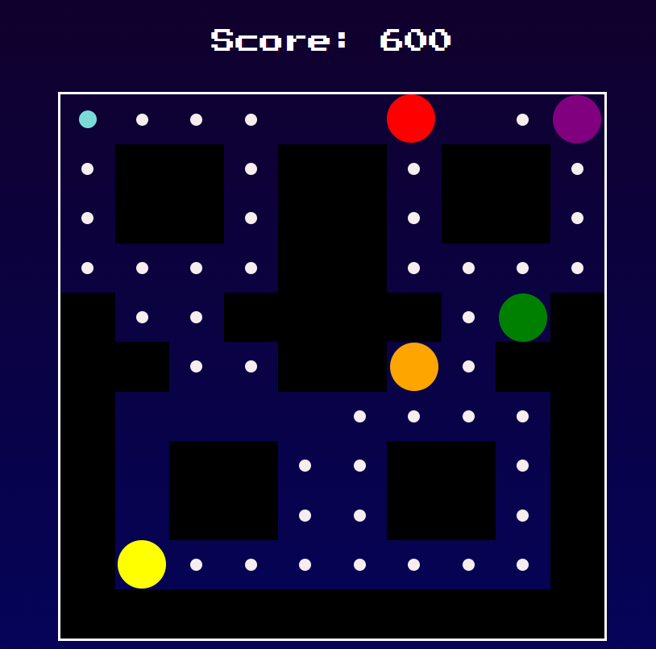

# Pac-Man

Pac-man is a game that was originated in Japan back in 1980. The player gets to control Pac-man and their main goal is to collect all the dots/pellets in the maze without getting caught by the 4 chasing ghosts.

The reason why I chose this game, is because Pac-man has been in everyone's lives growing up and I find it to be such a fun game which was something I was looking for while working on this project.

## Deployed game

[Pac-Man](https://zees-pacman.surge.sh/)

## Technologies used

- HTML
- CSS
- Javascript

## Next Steps

- Adding animation to pac-man itself where the mouth would open and close with each movement and also change directions.
- making the ghosts chase pac-man in its angry state, and when pac-man eats a power up pellet, they get into their scared states where they have to avoid pac-man or else they would get eaten and their positions would reset.
- adding more levels
- adding more difficulties and bigger mazes
